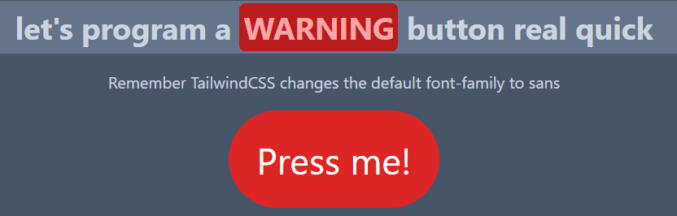

# JS Begginer Portafolio
(By JS i mean "JavaScript", not "Jorge Sarricolea")

As the name says... 
This repo intends to be some sort of "showcase" of my first small projects using JavaScript in order to develop my skills using Git, GitHub, HTML, CSS, JS at the same time.

# Current projects

## WaringButton (DONE)

